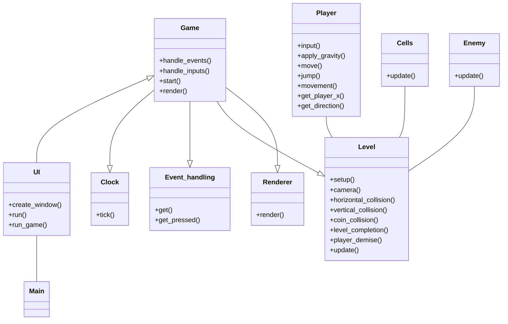

# Arkkitehtuurikuvaus

## Rakenne

## Sovelluksen toiminnallisuudet

### Käyttöliittymä

Sovelluksen käyttöliittymässä on kolme näkymää. Kaksi näkymää tuottaa PySimpleGUI kirjasto ja itse pelinäkymän tuottaa Pygame kirjasto. Ensimmäinen näkymä mikä aukeaa sovelluksen käynnistyksen yhteydessä on PySimpleGUI ikkuna jossa käyttäjä voi valita kentän mitä pelata (kenttien määrä ja siten kenttäpainikkeiden määrä määräytyy levels.txt tiedostossa olevien kenttien määrän mukaan).

Käyttäjä voi myös valita Time attack moodin sen nimisestä painikkeesta tai katsoa parhaita Time attack moodin läpäisyaikoja highscores painiketta painamalla. Highscores painike aukaisee toisen PySimpleGUI ikkunan jossa kolme parasta läpäisyaikaa on per kenttä esitettynä. Kolmas näkymä on pygame kirjastolla tuotettu pelinäkymä jonka leveys on vakio ja korkeus on riippuvainen kentän korkeudesta.

PySimpleGUI näkymät on toteutettu samassa UI luokassa ja pygame näkymää pyörittää Render luokka. 

Pelin käynnistäminen sekvenssikaaviona

Yllä olevassa sekvenssikaaviossa kuvataan mitä tapahtuu sen jälkeen kun käyttäjä klikkaa jotain aloitus käyttöliittymän level painikkeista. Ui luokan metodi run_game() alustaa tarvittavat riippuvuudet game luokan olion luomiseksi. Riippuvuudet injektoidaan game luokan olioon sen konstruktorin kautta. Game luokassa start() metodi pyörittää pygame peliä ylläpitävää silmukkaa, joka tarkastaa pelinäkymän tapahtumat, käyttäjän syötteet ja level luokan metodeilla level_completion() ja player_demise, sen tulisiko pelinäkymä pysäyttää tai aloittaa valittu pelikenttä alusta. 

Level luokan toiminta sekvenssikaaviona

Level luokka initialisoi pygame pelinäkymän mukaiset spritet konfigurointi tiedostosta saamansa level_map listan mukaan. Level luokka sisältää metodit spritejen väliselle törmäystarkastelulle, jolla tarkastetaan pelaajan hahmon osuminen vihollisiin, kolikoihin, artifakteihin ja kaikkiin seiniin, kattoihin ja lattioihin. Level luokassa on myös metodi pelinäkymän rullaavan kameran toteutukseen, se tarkistaa mikäli pelaaja on siirtynyt pelinäkymän reunalle, mikäli pelaaja jatkaa liikettään kohti reunaa, metodi muuttaa pelaajan nopeuden nollaan ja siirtää nopeuden camera_shift muuttujaan jonka avulla kaikkia spriteja siirretään sprite luokan update metodilla sivuun. 

