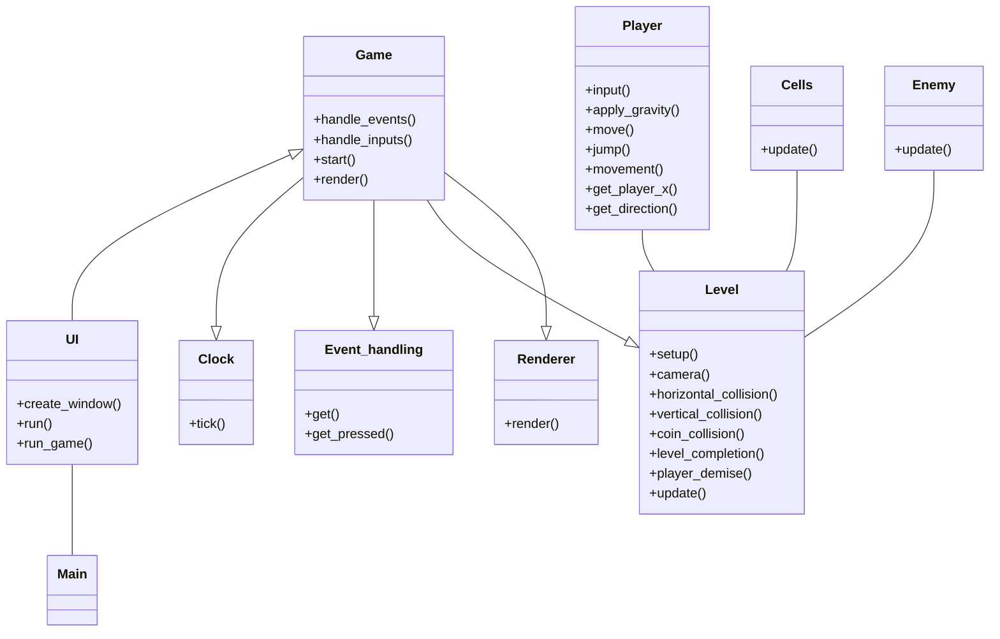

# Arkkitehtuurikuvaus

## Rakenne

## Sovelluksen toiminnallisuudet

Kun sovellus käynnistyy se avaa PySimpleGUI ikkunan joka toimii käyttöliittymänä sovellukselle. Tästä ikkunasta voi siirtyä itse peliin valitsemalla jonkin level painikkeista. Sovellus luo uuden säikeen ja käynnistää pygame kirjaston avulla renderöidyn pelinäkymän. Mikäli klikkaat Time Attack painiketta, peli käynnistyy rajoitetulla ajalla joka näkyy ajastimena vasemmassa nurkassa pelinäkymää. 

Pelin käynnistäminen sekvenssikaaviona

Level luokan toiminta sekvenssikaaviona

