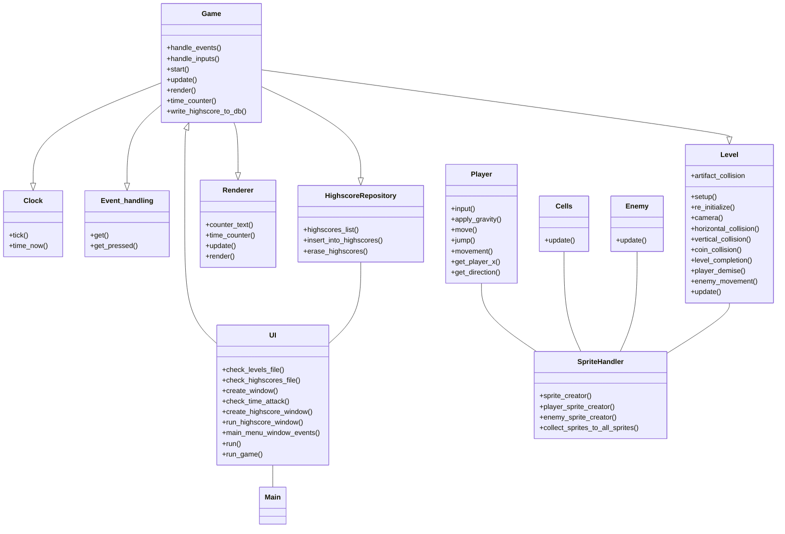

# Arkkitehtuurikuvaus

## Rakenne

Luokkien vastuut:

UI luokka initialisoi PySimpleGUI ikkunat joita on kaksi. Pääikkunasta voi katsoa highscore tietoja ja tämä aukaisee toisen PySimpleGUI ikkunan ja initialisoi luokan HighscoreRepository. Mikäli pääikkunassa valitaan pelattava kenttä Level painikkeilla, UI luokka initialisoi seuraavat luokat: Level, Clock, Renderer, EventHandling ja Game. Luokat Level, Clock, Renderer, EventHandling ja HighscoreRepository injektoidaan Game luokan riippuvuuksina sen konstruktoriin. 

- Clock luokka vastaa pelin pävitystaajuudesta Tick metodilla ja antaa Time attack moodin aloituksen yhteydessä tarvittavan aloitus aikaleiman metodilla time_now().

- Renderer luokka vastaa pelinäkymän renderöinnistä. 

- EventHandling vastaa tapahtumien hallinnasta pelissä, kuten näppäimistö komennot ja mikäli pelaaja sulkee ikkunan.

- HighscoreRepository luokka toteuttaa tietokantaoperaatiot joita tarvitaan kenttien parhaiden läpäisyaikojen pysyväistallennukseen.

- Level luokka initialisoi luokan SpriteHandler ja antaa sille initialisoitavaksi sprite olioita kenttädatan mukaan. Level luokka myös tekee kaiken törmäystarkastelun spritejen välillä. 

- SpriteHandler luokka initialisoi Cell, Player ja Enemy luokan olioita jotka perivät pygame.sprite.Sprites luokalta. SpriteHandler myös kerää luodut sprite oliot sprite group kokonaisuuksiksi jotta spriteja olisi helpompi käsitellä kokonaisuuksina. 

- Cell luokka luo yksinkertaisimmat sprite oliot jotka tarvitsevat vain yksinkertaisen päivitys metodin. 

- Player luokka luo pelaaja hahmon sprite olion jolla on useampi pelaajan liikkeeseen liittyvä metodi.

- Enemy luokka luo vihollis sprite olioita joilla on päivitys metodi ja suunta ja nopeus muuttujat.

- Game luokka kutsuu näiden luokkien metodeja run metodinsa silmukassa. Mikäli pelaaja pääsee kentän maaliin, tai Time attack moodissa aika loppuu kesken, tai pelaaja sulkee Pygame ikkunan, run metodin silmukka katkeaa ja palataan PySimpleGui päävalikkoon.

Sovelluksessa on myös muutamia moduuleja joissa ei ole luokkia vaan yksittäisiä metodeja. Nämä moduulit ja niiden vastuut ovat:

- build.py : Tässä moduulissa on sovelluksen tietokannan alustukseen tarvittava metodi.

- database_connection.py : Tämä moduuli luo tietokantayhteyden .env tiedostosta löytyvän nimiseen tietokantatiedostoon.

- database_initialization.py : Tässä moduulissa on metodit joilla varmistetaan että tietokantayhteyden avulla saatu tietokanta tiedosto on tyhjä ja siihen luodaan tarvittava taulu highscores. 

- settings.py : Tämä moduuli tarkistaa .env tiedoston mukaisen tietokantatiedoston olemassaolon ja jos sitä ei olemassa muodostaa sen nimisen tiedoston data kansioon. Tarkistaa myös levels.txt tiedoston olemassaolon ja isältää sprite koon ja pygame ikkunan koon määrittävät muuttujat jotka myös määritetään .env tiedostossa.

- helper_function.py : Tämä moduuli sisältää levels.txt tiedoston lukemiseen tarkoitetun funktion joka palauttaa kenttädatan listana.

- main.py : Tämä moduuli initialisoi UI luokan ja kutsuu sen run metodia joka käynnistää PySimpleGUI silmukan.

## Sovelluksen toiminnallisuudet

### Käyttöliittymä

Sovelluksen käyttöliittymässä on kolme näkymää. Kaksi näkymää tuottaa PySimpleGUI kirjasto ja itse pelinäkymän tuottaa Pygame kirjasto. Ensimmäinen näkymä mikä aukeaa sovelluksen käynnistyksen yhteydessä on PySimpleGUI ikkuna jossa käyttäjä voi valita kentän mitä pelata (kenttien määrä ja siten kenttäpainikkeiden määrä main menussa määräytyy levels.txt tiedostossa olevien kenttien määrän mukaan).

Käyttäjä voi myös valita Time attack moodin sen nimisestä painikkeesta tai katsoa parhaita Time attack moodin läpäisyaikoja highscores painiketta painamalla. Highscores painike aukaisee toisen PySimpleGUI ikkunan jossa kolme parasta läpäisyaikaa on per kenttä esitettynä, tämä tieto saadaan sqlite tietokanta tiedostosta. Highscores ikkunassa käyttäjä voi tyhjentää tietokannan sisältämät tiedot klikkaamalla "Erase scores" painiketta, tämä toiminnallisuus on toteutettu HighscoreRepository luokan metodien avulla. 

Kolmas näkymä on pygame kirjastolla tuotettu pelinäkymä jonka leveys on oletusarvoisesti 1200 pikseliä (tätä voi konfiguroida itse .env tiedostossa) ja korkeus on riippuvainen kentän sekä yksittäisen spriten korkeudesta (yksittäisen spriten kokoa voi konfiguroida .env tiedostossa).

PySimpleGUI näkymät on toteutettu samassa UI luokassa ja pygame näkymää pyörittää Render luokka game luokan ohjastamana. 

### Pelilogiikan toiminta

Kun peli käynnistetään jotain käyttöliittymän level painiketta painamalla UI luokka käynnistää uuden säikeen, joka huolehtii pygame ikkunan pyörittämisestä. Kun peli päättyy ja pygame ikkuna sulkeutuu tämä luotu säie lopetetaan ja palataan käyttöliittymän PySimpleGUi ikkunaan. Säikeiden käytöllä pygame ikkunan pyörittämiseen oli helpoin saada aikaan toiminnallisuus jossa pygame ikkuna sulkeutuu kokonaan, mutta käyttöliittymä ikkuna jää vielä käytettäväksi. 

Ui luokka initialisoi game luokan vaatimat riippuvuudet ja injektoi ne game luokan konstruktorin kautta. Seuraavaksi UI luokka initialisoi pygame ikkunan ja kutsuu game luokan metodia start(), joka käynnistää silmukan jossa päivitetään pelinäkymää. 

**Pelin käynnistäminen sekvenssikaaviona**

Game luokassa start() metodi pyörittää pygame peliä ylläpitävää silmukkaa, joka tarkastaa pelinäkymän tapahtumat, käyttäjän syötteet ja level luokan metodeilla level_completion() ja player_demise, sen tulisiko pelinäkymä pysäyttää tai aloittaa valittu pelikenttä alusta. 

**Level luokan toiminta sekvenssikaaviona**

Level luokka kutsuu SpriteHandler luokkaa initialisoimaan pygame pelinäkymän mukaiset spritet levels.txt tiedostosta saamansa level_map listan mukaan. Level luokka sisältää metodit spritejen väliselle törmäystarkastelulle, jolla tarkastetaan pelaajan hahmon osuminen vihollisiin, kolikoihin, artifakteihin ja kaikkiin seiniin, kattoihin ja lattioihin. Level luokassa on myös metodi pelinäkymän rullaavan kameran toteutukseen, se tarkistaa mikäli pelaaja on siirtynyt pelinäkymän reunalle, mikäli pelaaja jatkaa liikettään kohti reunaa, metodi muuttaa pelaajan nopeuden nollaan ja siirtää nopeuden camera_shift muuttujaan jonka avulla kaikkia spriteja siirretään sprite luokan update metodilla sivuun. 

Mikäli pelaaja osuu viholliseen tai putoaa pelinäkymästä pois, level luokan metodi player_demise() palauttaa game luokan metodille start() boolean arvon True, jolloin game luokan metodi start() kutsuu level luokan metodeja re_initialize() ja setup(). Näillä level luokan metodeilla ohjataan SpriteHandler luokan oliota uudelleen initialisoimaan kaikki kentät spritet ja level luokan setup() metodi käy kenttädatan uudelleen läpi. Tämän seurauksena peli palaa alku asetelmaansa. 

Mikäli pelaaja läpäisee kentän osumalla maalispriteen tai time attack moodissa aika loppuu kesken game luokan start metodin silmukka katkeaa ja peli päättyy, sovellus palaa silloin PySimpleGUI main menu näkymään. Jos time attack moodi oli käynnissä pelaajan osuessa maaliin game luokan start metodi kutsuu game luokan metodia write_highscore_to_db metodia ennen silmukan päättymistä. Tämä metodi kutsuu game luokkaan injektoitua HighscoreRepository oliota tallentamaan kentän läpäisyajan tietokantaan metodilla insert_into_highscores(). 

### Tietojen käsittely (tallennus, säilytys ja luku)

Sovellus käyttää SQLite tietokantaa tallentamaan kenttien läpäisyaikoja, käytössä on vain yksi taulu nimellä highscores. Tietokantaa käyttämään käytetään HighscoreRepository oliota jolla on metodit tiedon tallentamiseen, poistamiseen ja hakemiseen. Hakumetodi highscores_list() hakee tietokannasta yhdellä SQL komennolla kaikkien kenttien kolme parasta (lyhintä) läpäisyaikaa järjestettynä kenttien numeron mukaan ja palauttaa ne listana. Tietokannan highscores taulun yksi rivi sisältää kentän numeron ja läpäisyajan kahdella desimaalilla. 

Tietokannan tiedoston nimeä voi konfiguroida .env tiedoston kautta ja tietokanta tulee alustaa ennen sovelluksen käynnistystä komentorivikomennolla "poetry run invoke build". Tietokanta tiedosto sijaitsee sovelluksen data kansiossa. 

Sovelluksessa on myös tekstitiedosto levels.txt (nimeä voi konfiguroida .env tiedoston kautta) josta luetaan pelin kenttien koostumus. Käyttäjä voi itse muokata kenttiä ja luoda uusia käyttöohjeet sivun mukaisten ohjeiden mukaan. Sovelluksen "loppupalautus" release paketissa on kolme kenttää. Sovellus lukee kenttätietoja support kansiossa olevan helper_functions.py moduulin funktiolla level_file_reader() joka palauttaa kenttätiedot listana. Sovellus lisää tarvittavat "Level X" painikkeet käyttöliittymän main menu ikkunaan sen mukaan kuinka monta kenttää level_file_reader() funktion palauttamassa listassa on.  

