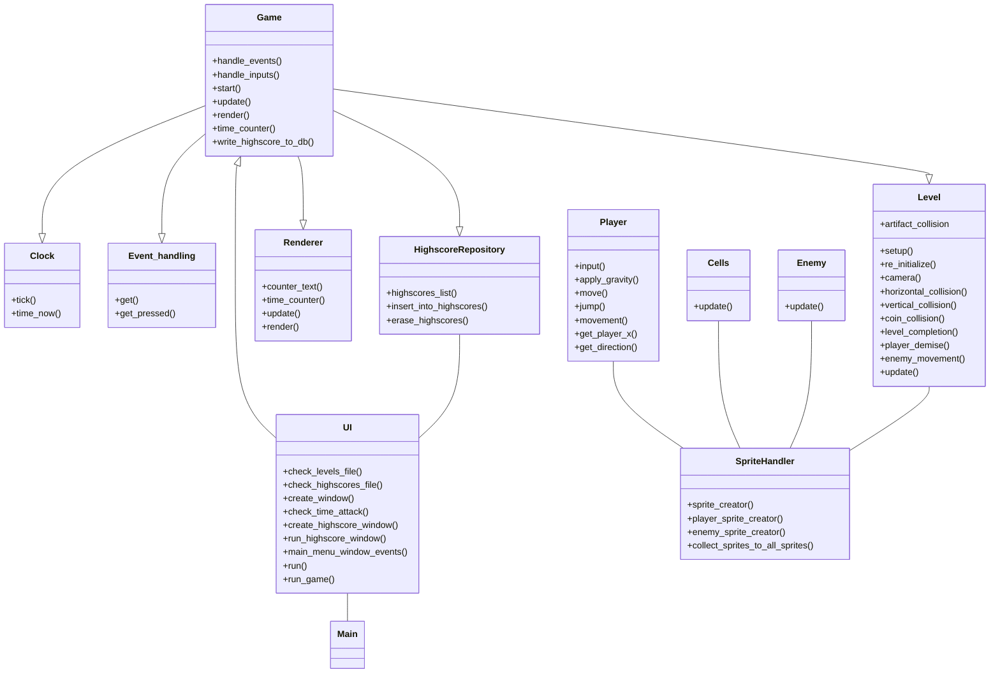

# Arkkitehtuurikuvaus

## Rakenne

Luokkien vastuut:

UI luokka initialisoi PySimpleGUI ikkunat joita on kaksi. Pääikkunasta voi katsoa highscore tietoja ja tämä aukaisee toisen PySimpleGUI ikkunan ja initialisoi luokan HighscoreRepository. Mikäli pääikkunassa valitaan pelattava kenttä Level painikkeilla, UI luokka initialisoi seuraavat luokat: Level, Clock, Renderer, EventHandling ja Game. Luokat Level, Clock, Renderer, EventHandling ja HighscoreRepository injektoidaan Game luokan riippuvuuksina sen konstruktoriin. 

- Clock luokka vastaa pelin pävitystaajuudesta Tick metodilla ja antaa Time attack moodin aloituksen yhteydessä tarvittavan aloitus aikaleiman metodilla time_now().

- Renderer luokka vastaa pelinäkymän renderöinnistä. 

- EventHandling vastaa tapahtumien hallinnasta pelissä, kuten näppäimistö komennot ja mikäli pelaaja sulkee ikkunan.

- HighscoreRepository luokka toteuttaa tietokantaoperaatiot joita tarvitaan kenttien parhaiden läpäisyaikojen pysyväistallennukseen.

- Level luokka initialisoi luokan SpriteHandler ja antaa sille initialisoitavaksi sprite olioita kenttädatan mukaan. Level luokka myös tekee kaiken törmäystarkastelun spritejen välillä. 

- SpriteHandler luokka initialisoi Cell, Player ja Enemy luokan olioita jotka perivät pygame.sprite.Sprites luokalta. SpriteHandler myös kerää luodut sprite oliot sprite group kokonaisuuksiksi jotta spriteja olisi helpompi käsitellä kokonaisuuksina. 

- Cell luokka luo yksinkertaisimmat sprite oliot jotka tarvitsevat vain yksinkertaisen päivitys metodin. 

- Player luokka luo pelaaja hahmon sprite olion jolla on useampi pelaajan liikkeeseen liittyvä metodi.

- Enemy luokka luo vihollis sprite olioita joilla on päivitys metodi ja suunta ja nopeus muuttujat.

- Game luokka kutsuu näiden luokkien metodeja run metodinsa silmukassa. Mikäli pelaaja pääsee kentän maaliin, tai Time attack moodissa aika loppuu kesken, tai pelaaja sulkee Pygame ikkunan, run metodin silmukka katkeaa ja palataan PySimpleGui päävalikkoon.

Sovelluksessa on myös muutamia moduuleja joissa ei ole luokkia vaan yksittäisiä metodeja. Nämä moduulit ja niiden vastuut ovat:

- build.py : Tässä moduulissa on sovelluksen tietokannan alustukseen tarvittava metodi.

- database_connection.py : Tämä moduuli luo tietokantayhteyden .env tiedostosta löytyvän nimiseen tietokantatiedostoon.

- database_initialization.py : Tässä moduulissa on metodit joilla varmistetaan että tietokantayhteyden avulla saatu tietokanta tiedosto on tyhjä ja siihen luodaan tarvittava taulu highscores. 

- settings.py : Tämä moduuli tarkistaa .env tiedoston mukaisen tietokantatiedoston olemassaolon ja jos sitä ei olemassa muodostaa sen nimisen tiedoston data kansioon. Tarkistaa myös levels.txt tiedoston olemassaolon ja isältää sprite koon ja pygame ikkunan koon määrittävät muuttujat jotka myös määritetään .env tiedostossa.

- helper_function.py : Tämä moduuli sisältää levels.txt tiedoston lukemiseen tarkoitetun funktion joka palauttaa kenttädatan listana.

- main.py : Tämä moduuli initialisoi UI luokan ja kutsuu sen run metodia joka käynnistää PySimpleGUI silmukan.

## Sovelluksen toiminnallisuudet

### Käyttöliittymä

Sovelluksen käyttöliittymässä on kolme näkymää. Kaksi näkymää tuottaa PySimpleGUI kirjasto ja itse pelinäkymän tuottaa Pygame kirjasto. Ensimmäinen näkymä mikä aukeaa sovelluksen käynnistyksen yhteydessä on PySimpleGUI ikkuna jossa käyttäjä voi valita kentän mitä pelata (kenttien määrä ja siten kenttäpainikkeiden määrä määräytyy levels.txt tiedostossa olevien kenttien määrän mukaan).

Käyttäjä voi myös valita Time attack moodin sen nimisestä painikkeesta tai katsoa parhaita Time attack moodin läpäisyaikoja highscores painiketta painamalla. Highscores painike aukaisee toisen PySimpleGUI ikkunan jossa kolme parasta läpäisyaikaa on per kenttä esitettynä, tämä tieto saadaan sqlite tietokanta tiedostosta. Kolmas näkymä on pygame kirjastolla tuotettu pelinäkymä jonka leveys on vakio ja korkeus on riippuvainen kentän korkeudesta.

PySimpleGUI näkymät on toteutettu samassa UI luokassa ja pygame näkymää pyörittää Render luokka game luokan ohjastamana. 

Pelin käynnistäminen sekvenssikaaviona

Yllä olevassa sekvenssikaaviossa kuvataan mitä tapahtuu sen jälkeen kun käyttäjä klikkaa jotain aloitus käyttöliittymän level painikkeista. Ui luokan metodi run_game() alustaa tarvittavat riippuvuudet game luokan olion luomiseksi. Riippuvuudet injektoidaan game luokan olioon sen konstruktorin kautta. Game luokassa start() metodi pyörittää pygame peliä ylläpitävää silmukkaa, joka tarkastaa pelinäkymän tapahtumat, käyttäjän syötteet ja level luokan metodeilla level_completion() ja player_demise, sen tulisiko pelinäkymä pysäyttää tai aloittaa valittu pelikenttä alusta. 

Level luokan toiminta sekvenssikaaviona

Level luokka initialisoi pygame pelinäkymän mukaiset spritet konfigurointi tiedostosta saamansa level_map listan mukaan. Level luokka sisältää metodit spritejen väliselle törmäystarkastelulle, jolla tarkastetaan pelaajan hahmon osuminen vihollisiin, kolikoihin, artifakteihin ja kaikkiin seiniin, kattoihin ja lattioihin. Level luokassa on myös metodi pelinäkymän rullaavan kameran toteutukseen, se tarkistaa mikäli pelaaja on siirtynyt pelinäkymän reunalle, mikäli pelaaja jatkaa liikettään kohti reunaa, metodi muuttaa pelaajan nopeuden nollaan ja siirtää nopeuden camera_shift muuttujaan jonka avulla kaikkia spriteja siirretään sprite luokan update metodilla sivuun. 

